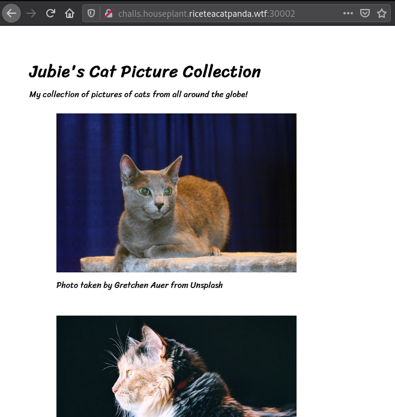
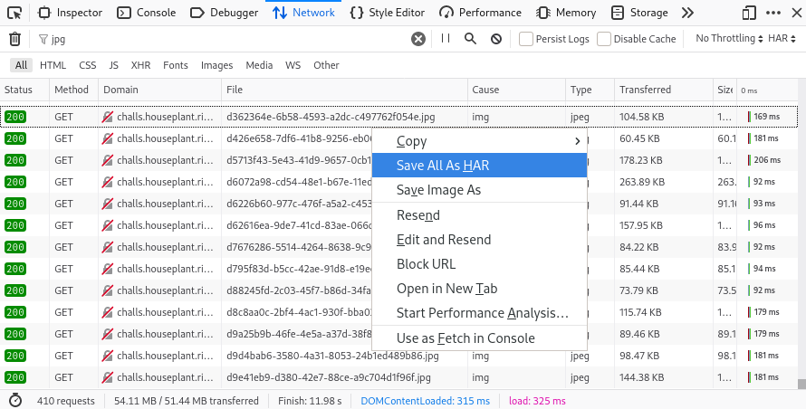
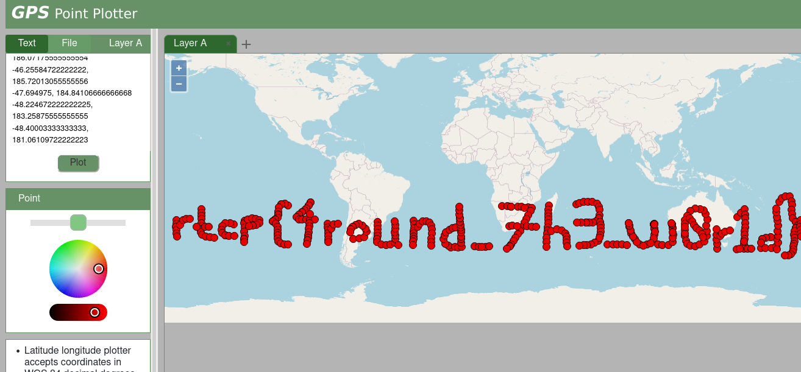

## Catography

This was the challenge text:
```
Catography - 1,575 Points

Jubie's released her own collection of cat pictures. Go check it out!

http://challs.houseplant.riceteacatpanda.wtf:30002

Note: The Unsplash author credit is not a part of the challenge, it's only there to conform with the Unsplash image license.

Dev: jammy 
```

When you browse to `http://challs.houseplant.riceteacatpanda.wtf:30002` you're presented with a stream of cat pictures:



They load as you scroll, there are 83 pages in total. I wanted to download all of them. So I used the Firefox developer tools in Network mode, searched for "jpg" and then downloaded the HAR file.



This is an HTTP archive file that is in JSON format. I used it to download all the cat pictures like this:

```python
import json
import requests

with open('output.har') as f:
    data = json.loads(f.read())

urls = [i['request']['url'] for i in data['log']['entries']]

for url in urls:
     with open('cat_pics/' + url.split('/')[-1], 'wb') as f:
         f.write(requests.get(url).content)
```

There are a 410 cat pictures:
```
$ ls pics/ | wc -l
410
```

I noticed that each picture contained some interesting GPS information:
```
$ exiftool pics/002c1282-11e2-4d01-bfff-348ab6f0301c.jpg | grep GPS
GPS Latitude                    : 27 deg 50' 20.67" S
GPS Longitude                   : 169 deg 32' 15.05" W
GPS Latitude Ref                : South
GPS Longitude Ref               : West
GPS Position                    : 27 deg 50' 20.67" S, 169 deg 32' 15.05" W
```

Using some bashfu, I extracted all of this GPS information from every file:
```
$ for f in *.jpg; do exiftool $f | grep -i "GPS position" >> gps.txt; done
$ cat gps.txt
GPS Position                    : 27 deg 50' 20.67" S, 169 deg 32' 15.05" W
GPS Position                    : 29 deg 59' 34.81" S, 169 deg 42' 47.97" W
GPS Position                    : 31 deg 39' 12.17" S, 169 deg 53' 20.90" W
...
```

I thought it would be interesting to plot all of these on a single map, maybe it spells something out? I found [a cool website](https://gpspointplotter.com/) to do this, but it wanted the coordinates in (latitude, longitude) decimal format. So I hacked together some python code to convert the given DMS (degree, minutes, seconds) format to latitude & longitude coordinates.

```python
import re

def do_thing(s):
    deg, minutes, seconds, direction = re.split('[°\'"]', s)
    return (float(deg) + float(minutes)/60 + float(seconds)/(60*60)) * (-1 if direction in ['W', 'S'] else 1)

with open('gps.txt','r') as f:
    data = f.read().splitlines()

for line in data:
    deg1, _, m1, s1, dir1, deg2, _, m2, s2, dir2 = line.split()[3:]
    deg1 += '°'
    deg2 += '°'
    dir1 = dir1.rstrip(',')
    dir2 = dir2.rstrip(',')
    conv1 = deg1 + m1 + s1 + dir1
    conv2 = deg2 + m2 + s2 + dir2
    print(str(do_thing(conv1)) + ', ' + str(do_thing(conv2)))
```

I pumped all of this to a file:
```
$ python solve.py > coords.txt
$ cat coords.txt
-27.839074999999998, -169.5375138888889
-29.99300277777778, -169.713325
-31.653380555555554, -169.88913888888888
...
```

I then used the [GPS Point Plotter](https://gpspointplotter.com/) website to plot them all:



It spells out the flag `rtcp{4round_7h3_w0rl1d}`, very cool!
