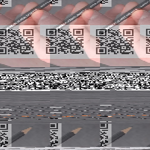

## Satan's Jigsaw

This was the challenge text:
```
Satan's Jigsaw - 736 Points

Oh no! I dropped my pixels on the floor and they're all muddled up! It's going to take me years to sort all 90,000 of these again :(

Dev: Tom
Hint! long_to_bytes

chall.7z
```

I first extracted the pictures, there are indeed 90,000 of them!
```
$ 7z x chall.7z
...
$ find chall/ -type f | wc -l
90000
```

Each jpg is a 1x1 pixel:
```
$ mediainfo chall/54082768285744.jpg 
General
Complete name                            : chall/54082768285744.jpg
Format                                   : JPEG
File size                                : 631 Bytes

Image
Format                                   : JPEG
Width                                    : 1 pixel
Height                                   : 1 pixel
Color space                              : YUV
Chroma subsampling                       : 4:2:0
Bit depth                                : 8 bits
Compression mode                         : Lossy
Stream size                              : 631 Bytes (100%)
```

I decided to use Python with PIL to write the pixels to an image by ordering them by their file name number. I took a first guess that perhaps the dimensions of the picture were (300x300 = 90,000):
```python
import os
from PIL import Image

files = sorted(os.listdir('chall/'))

final_image = Image.new('RGB', (300, 300))

i = 0
pixels = []
for f in files:
    im = Image.open('chall/' + f)
    pixel = im.load()[0, 0]
    pixels.append(pixel)
    i += 1

final_image.putdata(pixels)
final_image.save('test.png')
```

The result:



The dimensions I guessed are off, but we can make out a QR code to scan. 

It gives us the flag: `rtcp{d1d-you_d0_7his_by_h4nd?}`
