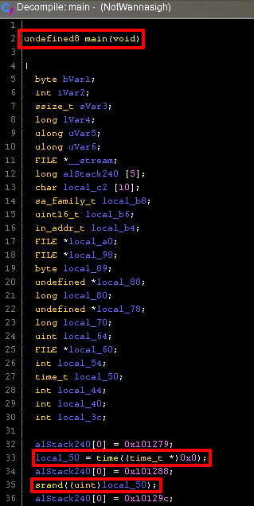
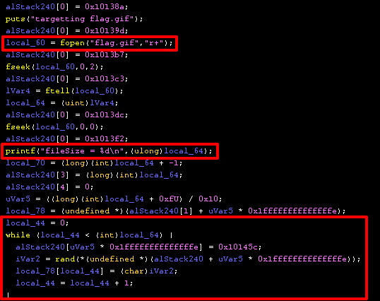

## NotWannasigh WPICTF 2020 Writeup

This was my favorite challenge from WPICTF! Thanks "Abjuri5t (John F.)" for making it.

This was the challenge text:

```
NotWannasigh - 100 points (RE)

Please help! An evil script-kiddie (seriously, this is some bad code) was able to get this ransomware "NotWannasigh" onto one of our computers. The program ran and encrypted our file "flag.gif".

These are the resources we were able to gather for you:

    * NotWannasigh.zip - the malicious ransomware executable
    * flag-gif.EnCiPhErEd - our poor encrypted file that we need you to recover
    * ransomNote.txt - the note left behind by the ransomware. I'm not sure you'll find anything usefull here
    * 192-168-1-11_potential-malware.pcap - a packet capture that our IDS isolated, it seems that the program has some weird form of data exfiltration

We need you to reverse the malware and recover our flag.gif file. Good luck!

A note from the creator: Shoutout to Demonslay335 for challenge inspiration - he's done some awesome work in fighting ransomware. Also, the ransomware in this challenge is programmed to only target files named "flag.gif" so you shouldn't need to worry about the accidental execution, I just zipped it out of habit/good practice. Have fun and happy hacking!

    Abjuri5t (John F.)

http://us-east-1.linodeobjects.com/wpictf-challenge-files/192-168-1-11_potential-malware.pcap

http://us-east-1.linodeobjects.com/wpictf-challenge-files/ransomNote.txt

http://us-east-1.linodeobjects.com/wpictf-challenge-files/flag-gif.EnCiPhErEd

http://us-east-1.linodeobjects.com/wpictf-challenge-files/NotWannasigh.zip
```

Let's take a look at the ransom note first:
```
$ cat ransomNote.txt 
Haha! Your precious file flag.gif has been encrypted by my new and improved ransomware NotWannasigh! You must send bitcoin to "bitpay.com/83768" to get the decryption key. You should act fast because in 48 hours I will delete the key. Muahahahaha!
 - def-not-h4ckah

(Hi, CTF challenge creator here. You should _NEVER_ pay the ransom. If you send bitcoin to that BTC wallet then you will ONLY be donating to charity (and hey, that's really nice of you, Mental Health Hackers is a great organization). I will NOT send you the decryption key)
```

Not much here. Let's take a look at the encrypted flag:

```
$ file flag-gif.EnCiPhErEd 
flag-gif.EnCiPhErEd: data
$ xxd flag-gif.EnCiPhErEd | head
00000000: 92eb 1dec 0cfb 664c 858b 4183 03ce 59cf  ......fL..A...Y.
00000010: e19a fea0 2ca1 5776 4f76 785d 1305 e2cf  ....,.WvOvx]....
00000020: ee1d f232 8ccd 14f6 4352 6877 8bcb 88dc  ...2....CRhw....
00000030: 49ac 1024 0bd6 c554 908c d9af c987 b9bc  I..$...T........
00000040: dd79 b762 c0dd 04cb de58 35e3 38b3 b96f  .y.b.....X5.8..o
00000050: 9aa6 350b da73 61cf 08ea dbfd f08d a785  ..5..sa.........
00000060: dc83 9d62 31eb ecbe fa51 5373 e0aa 3b67  ...b1....QSs..;g
00000070: 0b28 5436 e2e4 54c9 2d63 e318 d760 8221  .(T6..T.-c...`.!
00000080: 8f39 baa8 1c92 fc17 5753 e04a 182d c56e  .9......WS.J.-.n
00000090: 7319 5c0f 0282 247b 1139 4bc3 7617 cdca  s.\...${.9K.v...
```

Not encrypted in any discernible way... Let's take a look at the PCAP in Wireshark.


There's one HTTP request here we can take a look at:


The "ransomware victim" sent out a number (`1585599106`) to the malicious server which is interesting. This looks like an epoch time, and sure enough it is:

```
$ date -d @1585599106
Mon 30 Mar 2020 03:11:46 PM CDT
```

Alright, let's take a look at the ransomware now:
```
$ unzip NotWannasigh.zip
Archive:  NotWannasigh.zip
  inflating: NotWannasigh
$ file NotWannasigh
NotWannasigh: ELF 64-bit LSB pie executable, x86-64, version 1 (SYSV), dynamically linked, interpreter /lib64/ld-linux-x86-64.so.2, BuildID[sha1]=ca17985d5f493aded88f81b8bfa47206118c6c9f, for GNU/Linux 3.2.0, not stripped
```

It's a single Linux ELF 64-bit executable. I decided to use Ghidra to inspect it.



I decompiled the `main` function and right away I can see it got the epoch time it later sends stored in the variable `local_50`. This epoch time is then used to seed the random using `srand`, this will be very important later on.


We can follow the decompilation and see a socket is created and stored in variable `local_54`, the same IP address we saw in the PCAP is being connected to here, the epoch time is stored as a string using `sprintf` into variable `local_c2`. Then `local_c2` is sent to the malicious server. This is exactly what we saw in the PCAP!

So now the question is: why is this epoch time important? Let's keep reading the decompiled C code...



A few things interesting things happen:

* `local_60` is created to open the `flag.gif` file
* `local_64` is created which is the file size of `flag.gif`
* A loop is done over the file size of `flag.gif` which generates random chars that are placed in an array `local_78`. Keep in mind, this is using `rand` which was seeded with an epoch time we have knowledge of from the PCAP!

This still hasn't done any encryption, but it has created a random character array (`local_78`) of equal size to `flag.gif`. Let's see what happens with this array... 


Reading decompliation can be messy & tricky, but let's break it down:
* Inside the first loop, `fgetc` is used to read the characters from `flag.gif`. **These plaintext characters are then XOR'd with the random characters that were created in `local_78`!** I put a star next to this because it's very important! This XOR'd data is stored in array `local_88`. This is the encrypted data.
* The `flag.gif` is deleted.
* A new file `flag-gif.EnCiPhErEd` is created.
* A final loop is conducted to now write this encryted data to the encrypted file. This is done by looping over the array `local_88` and writing it to the file using `fputc`.

Phew! Ok, we now understand the important parts of what this ransomware is doing. So how do we get our flag back? Since we know the random seed, we can create the same random data this ransomware is creating and then reverse the XOR operation. Let's write some C to generate the same random characters:

```c
/*
    gen_array.c
*/

#include <stdio.h>
#include <stdlib.h>

int main()
{
    /* seed random from the epoch time extracted from PCAP */
    srand(1585599106);

    /*
        An unsigned character array, the same length as the
        number of bytes in the encrypted file.

        $ du -b flag-gif.EnCiPhErEd
        374109	flag-gif.EnCiPhErEd
    */
    unsigned char *stream = malloc(374109);

    for (int i = 0; i < 374109; i++) {
        /* create a random character */
        stream[i] = rand();
        printf("%d ", stream[i]);
    }

    return 0;
}
```

Let's compile this, run it, and drop the random characters to a file:
```
$ gcc gen_array.c -o gen_array
$ ./gen_array > srand_bytes.txt
$ cat srand_bytes.txt
213 162 91 212 53 154 186 76 249 139 182 131 3 206 89 207 ...
```

Now, I'm going to write some python to take these random characters and XOR them against the bytes of the encrypted file, which should unencrypt the flag.gif!

```python
#!/usr/bin/env python

#
# fix_gif.py
#

# read in the encrypted gif
with open('flag-gif.EnCiPhErEd', 'rb') as f:
    encryted_bytes = [i for i in f.read()]

# read in the srand numbers we generated in C
with open('srand_bytes.txt', 'r') as f:
    srand_bytes = list(map(int, f.read().split()))

# XOR the encrypted bytes and the srand_bytes
gif = []
for a, b in zip(encryted_bytes, srand_bytes):
    gif.append(a ^ b)

# write the XOR'd data
with open('flag.gif', 'wb') as f:
    b = bytearray(gif)
    f.write(b)
```

Let's cross our fingers and run our python script:

```
$ python fix_gif.py
$ file flag.gif
flag.gif: GIF image data, version 89a, 220 x 124
```

Hell, yes!


It's a bit hard to see, but the flag is: `WPI{It_always_feels_a_little_weird_writing_malware}`

This was a great RE challenge, I really enjoyed it. Unil next time, ~vesche
