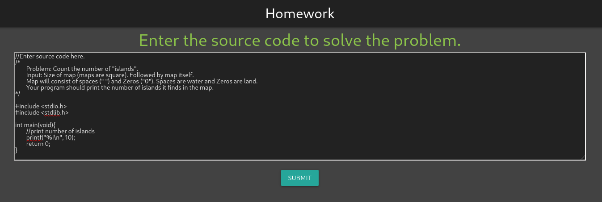
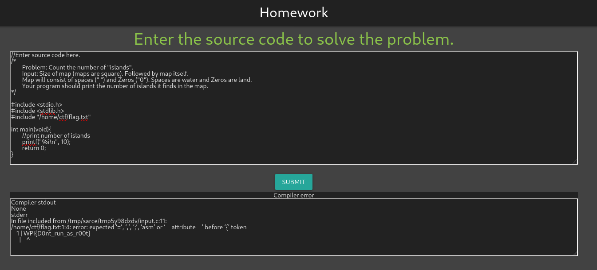

## autograder WPICTF 2020 Writeup

`https://autograder.wpictf.xyz/` takes you here:

You can abuse the preprocessor to get the flag:

You can also use this old school preprocessor hack to get the flag `%:include "/home/ctf/flag.txt"`